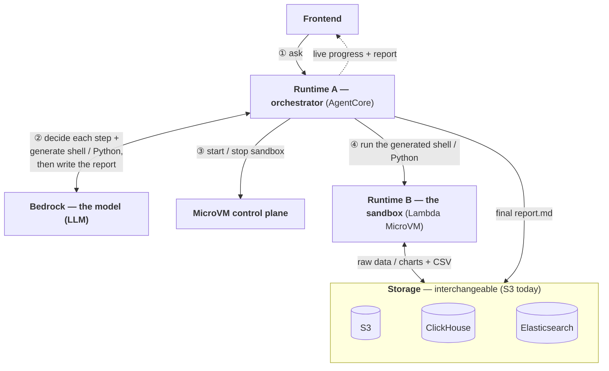
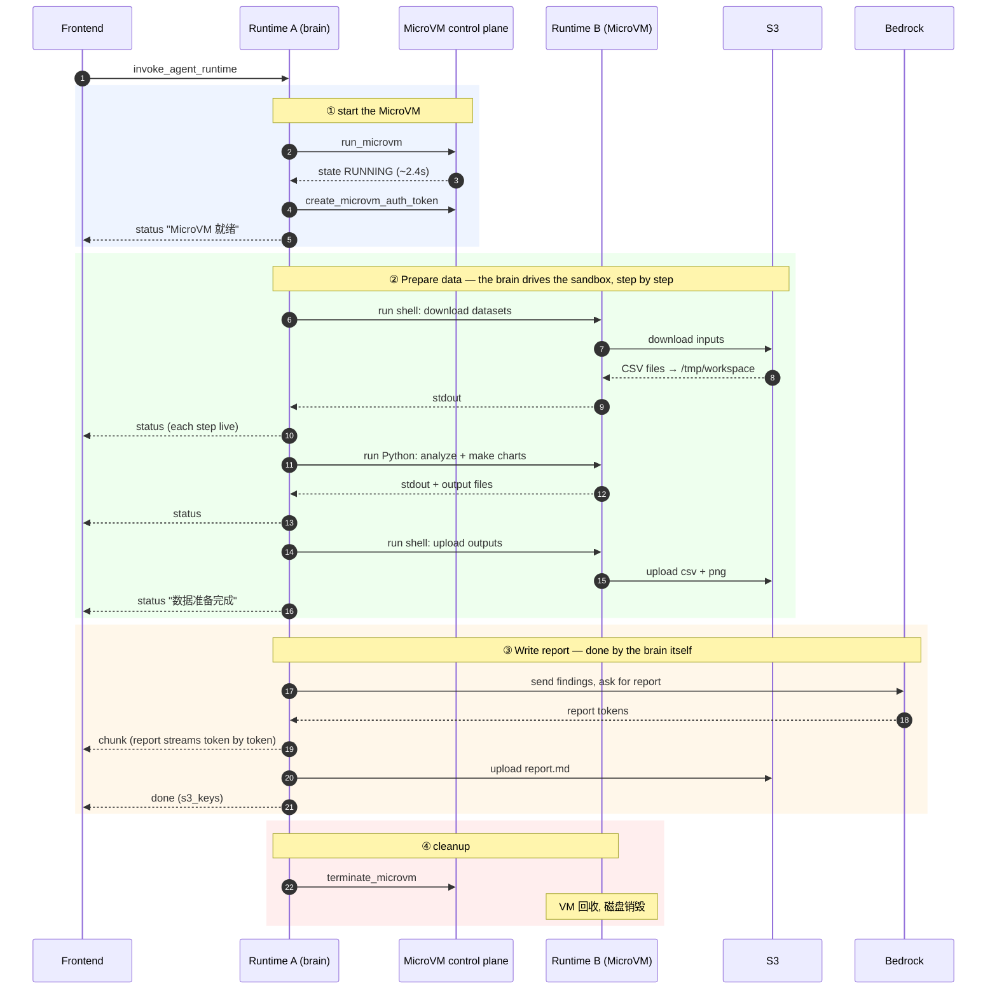
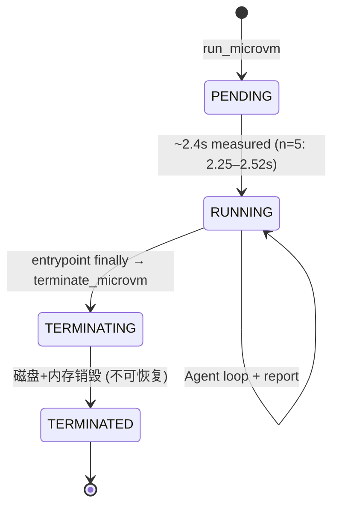

# AgentCore + Lambda MicroVMs Architecture Design (V5)

## What changed from V3

V5 keeps the V3 philosophy — **大脑与手脚分离** (Agent A is the sole brain,
Runtime B is a pure executor) — but makes two structural changes:

1. **Runtime B moves from AgentCore Runtime to a Lambda MicroVM.**
   AgentCore auto-routed same-session calls to the same microVM. With MicroVMs,
   Runtime A manages the lifecycle explicitly per request:
   `run_microvm → poll RUNNING → create_microvm_auth_token → call endpoint → terminate_microvm`.

2. **Report generation moves from Runtime B into Runtime A.**
   In V3 Runtime B had a `report` action that called `converse_stream`. In V5
   Runtime A renders the report itself (it already had Bedrock access and the
   analysis text in hand). Runtime B is now a pure code executor: `shell` + `python` only.

| | V3 | V5 |
|---|---|---|
| Runtime A | AgentCore, Agent A brain | AgentCore, Agent A brain **+ MicroVM lifecycle + report** |
| Runtime B | AgentCore Runtime, shell/python/**report** | **Lambda MicroVM**, shell/python only |
| B invocation | `invoke_agent_runtime` (same session → same microVM) | HTTPS to MicroVM endpoint (`X-aws-proxy-auth`) |
| Report rendered by | Runtime B (`converse_stream`) | **Runtime A** (`converse_stream`) |
| B lifecycle | AgentCore-managed (opaque) | **Runtime A-managed** (run/terminate per request) |

---

## Architecture — components

The model (Bedrock) is what decides each step **and generates the shell/Python**;
Runtime A only orchestrates. Storage is a swappable layer — S3 today, but
ClickHouse / ES could stand in without touching the brain.



Each module, and what it does / does not do:

| Module | Does | Does NOT |
|--------|------|----------|
| **Frontend** | sends the question; renders live progress + streaming report | any logic |
| **Runtime A — orchestrator** | runs the agent loop, calls the model, starts/stops the sandbox, relays SSE, uploads the report | decide content itself; touch data files |
| **Bedrock — the model** | **decides each step and generates the shell/Python**, then writes the report from the findings | execute anything |
| **MicroVM control plane** | starts a fresh isolated sandbox on demand, tears it down when done | run user code |
| **Runtime B — the sandbox** | executes the model's shell/Python in isolation: fetch data, compute, make charts | make decisions |
| **Storage** | per-tenant data in / results out; S3, ClickHouse, ES interchangeable | — |

What each connection carries, technically:

| Connection | How |
|------------|-----|
| Frontend ↔ Runtime A | `invoke_agent_runtime`, replies as SSE (`status` / `chunk` / `done`) |
| Runtime A ↔ Bedrock | `converse_stream`; the model picks a tool and generates its `command`/`code` during data prep, then writes the report |
| Runtime A → control plane | `boto3 lambda-microvms`: `RunMicrovm` / `GetMicrovm` / `CreateAuthToken` / `Terminate` |
| Runtime A → Runtime B | HTTPS + `X-aws-proxy-auth`; Runtime B exposes `:8080` shell/python, `:9000` lifecycle hooks, `/tmp/workspace` disk |
| Runtime B ↔ Storage / Runtime A → Storage | `aws cli` for data, `put_object` for the report — `tenants/{id}/datasets` in, `tenants/{id}/reports/analysis_report.md` out (S3 today) |

---

## Data flow — sequence

One request, top to bottom. S3 and Bedrock are **separate** lanes.



Verified on AWS us-west-2: 10 status + 745 chunk + 1 done = 756 events, 184s, cold start 2.25s.

### SSE event stream (actual output)

```
[status]  正在启动 MicroVM 工作站...              ← ① run_microvm
[status]  MicroVM 就绪 (2.25s)                     ← cold start (PENDING→RUNNING)
[status]  Agent 开始分析...
[status]  正在执行: runtime_b_shell                ← ② 准备数据, 每个步骤实时推送
[status]  正在执行: runtime_b_python
[status]  正在执行: runtime_b_shell
[status]  数据准备完成
[status]  正在生成分析报告 (Opus streaming)...      ← ③ 写报告, 由大脑(Runtime A)完成
[chunk]   # 2026 Q1 各区域销售达成率分析报告 ...    ← 745 chunks 流式
[chunk]   ## 概述 ...
[done]    s3_keys: [analysis_report.md]            ← put_object 完成, MicroVM 在 finally 中 terminate
```

---

## MicroVM lifecycle states



- Idle policy 配了 auto-suspend (`maxIdleDurationSeconds=900`)，但本工作流单请求秒级完成，
  通常在 idle 触发前就 terminate。suspend/resume 主要服务长 idle 的交互式场景。
- `maximumDurationInSeconds=1800` (30 min) 安全上限；8h 硬上限见下文。

---

## Disk reuse & why outputs go to S3 via CLI (not a mount)

Runtime B has a real local disk (`/tmp/workspace`, up to 32 GB). Files persist
across `shell`/`python` calls **within the same MicroVM**:

```
shell : aws s3 cp s3://.../datasets/ /tmp/workspace/ --recursive   download → local disk
python: pd.read_csv("/tmp/workspace/...")                          read local disk
        df.to_csv("/tmp/workspace/output/x.csv")                   write local disk  (call 1)
python: plt.savefig("/tmp/workspace/output/x.png")                 write local disk  (call 2, same disk reused)
shell : aws s3 cp /tmp/workspace/output/ s3://.../reports/ -r      upload outputs → S3
```

**Why S3 outputs use `aws cli` / boto3 PUT, not a mounted filesystem:**
Mounting S3 as a filesystem (Mountpoint-for-S3, FUSE) is possible inside a MicroVM
(install `mount-s3` + `additionalOsCapabilities: ["ALL"]`), but its write semantics
are constrained — sequential whole-file writes only, **no append, no rename** on
general-purpose buckets. Tools like `pandas.to_csv` / `matplotlib.savefig` often
write-then-rename, which would fail on a mounted bucket. So we **write to local
disk** (full POSIX, no limits, reused across calls) and **PUT to S3 at the end**.
A FUSE mount would only help the read path; for this workload plain `aws s3 cp`
is simpler and avoids the write pitfalls.

---

## Dependency pre-baking (install once, at image-build time)

**All runtime dependencies are installed into the MicroVM image and captured in
its snapshot. The agent never installs anything at request time** — that would
add minutes per request and often fail. The system prompt explicitly forbids
`pip install` and font configuration.

### How it works

When you call `create-microvm-image`, Lambda runs your `Dockerfile` once,
starts the app, and takes a Firecracker snapshot of the fully-initialized
memory+disk. Every `run-microvm` resumes from that snapshot — packages, fonts,
and aws cli are already present. This is the same reason cold start is ~2.4s
(resume, not boot+install).

### What is baked in (`runtime_b_v5/Dockerfile`)

```dockerfile
FROM public.ecr.aws/lambda/microvms:al2023-minimal

# OS packages: python, pip, and CJK fonts (al2023-minimal has none → matplotlib
# would render Chinese as boxes without these).
RUN dnf install -y python3 python3-pip google-noto-sans-cjk-ttc-fonts && dnf clean all

WORKDIR /app
COPY requirements.txt .
# Python libs + awscli via pip. Install awscli via pip (NOT dnf): the dnf awscli
# ships a 2nd copy under /usr/bin that can't see pip deps (dateutil) → ImportError.
RUN pip3 install --no-cache-dir awscli -r requirements.txt   # requirements: pandas, numpy, matplotlib

COPY main.py .
CMD ["python3", "main.py"]                                   # /ready hook → Lambda snapshots
```

`runtime_b_v5/requirements.txt`:

```
pandas
numpy
matplotlib
```

Runtime B's `main.py` also sets the matplotlib default CJK font **once at module
load** (`_configure_cjk_font()`), so chart code needs no font handling.

### Steps to (re)bake dependencies

1. **Edit deps** — add libraries to `runtime_b_v5/requirements.txt` (or OS
   packages to the `dnf install` line in the Dockerfile).
2. **Package + upload** — zip `main.py`, `requirements.txt`, `Dockerfile` and
   upload to a **same-region** S3 artifact bucket:
   ```bash
   cd runtime_b_v5 && zip -r /tmp/rb.zip main.py requirements.txt Dockerfile
   aws s3 cp /tmp/rb.zip s3://<artifact-bucket>/microvm/runtime_b_v5.zip --region <region>
   ```
3. **Build the image** — first time: `create-microvm-image`; to ship new deps
   later: `update-microvm-image` (a new image version). `deploy_v5.sh` does the
   first build; both require `--base-image-arn` + `--build-role-arn` each call.
4. **Wait for `CREATED`/`UPDATED`** — poll `get-microvm-image`. The Dockerfile
   ran on the build fleet; the result is a snapshot, not a per-request install.
5. **Point Runtime A at it** — set `MICROVM_IMAGE_ARN` (the latest active
   version is used by default).

> Verify a package is really baked: `run-microvm`, then
> `POST {"action":"python","code":"import pandas, matplotlib; print('ok')"}` —
> it should succeed with no install step.

---

## ⚠️ 8-hour lifecycle limit & roadmap

> This section records a real constraint and the planned fix. **V5 does not
> implement long-running (>8h) handling** — the current analysis workload is
> minutes-long. Documented here so the relay design is ready when needed.

### The limit (verified against AWS docs, 2026-06)

- A MicroVM's `maximumDurationInSeconds` caps **running + suspended combined** at
  **28,800s (8h)**. Suspending does **not** extend the clock — idle time still
  counts toward the 8h.
- On reaching the limit the MicroVM goes to `TERMINATED`, a **terminal state**:
  "cannot be resumed or restarted." Disk and memory are destroyed.
- **AgentCore Runtime has the identical 8h cap** (`maxLifetime` default 8h), so
  this is not a MicroVM-specific regression — it is inherent to both.

### How to continue past 8h (today): the relay pattern

You cannot extend one VM. You start a **new** VM and restore state from S3:

```
maximumDurationInSeconds = 7.5h         # leave a buffer, don't race the 8h wall
task checkpoints to S3 periodically / per logical step
/suspend + /terminate hooks → final flush to S3
orchestrator (Runtime A / Step Functions / control-plane Lambda):
  on ~7.5h timer OR detecting TERMINATED-while-incomplete
  → run_microvm (new VM, fresh 8h clock)
  → /run hook restores checkpoint from S3
  → resume work
= a chain of ≤8h VMs stitched together by S3 state
```

This handles **checkpointable** tasks. A task whose progress is **pure in-memory
and not serializable** (e.g. a 10h in-memory computation with no save points)
cannot be relayed by any serverless option today — that needs EC2/ECS/Batch, or
the roadmap item below.

### Roadmap (AWS, expected)

- **Snapshot-to-S3 + restore** for MicroVMs: snapshot the full VM (memory + disk)
  to S3 and restore it into a new VM with a fresh lease. This is the platform-native
  answer — it carries **memory state**, which app-level S3 checkpointing cannot.
  When available, it supersedes the relay pattern for the >8h case.

### Optional UX: ask-before-suspend (interactive sessions only)

For **interactive** sessions (a human at the screen) or **high-cost** runs, a
"session expiring in N minutes — persist & continue?" prompt is reasonable as a
cost circuit-breaker. For **autonomous batch** tasks it is an anti-pattern: the
decision (checkpoint if incomplete) should be automatic, and a silent default
must never drop work — default to **persist + terminate**, never "do nothing".

### Storage comparison (relevant to long tasks)

| | Lambda MicroVMs | AgentCore Runtime |
|---|---|---|
| In-VM disk | 32 GB, persists across suspend/resume | session disk, persists across stop/resume |
| Cross-VM / durable | **none managed — must write S3** | **managed session storage** (`/mnt/workspace`, survives stop/resume, 14-day idle expiry); can also mount EFS / S3 Files |
| Mountable volumes | DIY Mountpoint-for-S3 only (read-friendly) | managed S3 Files / EFS |

For >8h checkpointable work, AgentCore's managed session storage auto-reattaches
disk to the next compute — MicroVMs require DIY S3 checkpointing until snapshot-to-S3 ships.
Neither preserves **memory** state across the 8h boundary today.

---

## Deployment notes

- **boto3 ≥ 1.43.36** is required for the `lambda-microvms` / `lambda-core` clients.
- MicroVMs available regions (2026-06): us-east-1, us-east-2, us-west-2, eu-west-1, ap-northeast-1. ARM64 only.
- Base image (e.g. us-west-2): `arn:aws:lambda:us-west-2:aws:microvm-image:al2023-1`
- Network bandwidth is tied to MicroVM size (2 GB/1 vCPU ≈ 4 MB/s). For large S3
  datasets, size the MicroVM up to avoid a bandwidth bottleneck on `aws s3 cp`.
- See `deploy_v5.sh` for image build + Runtime A deploy.
