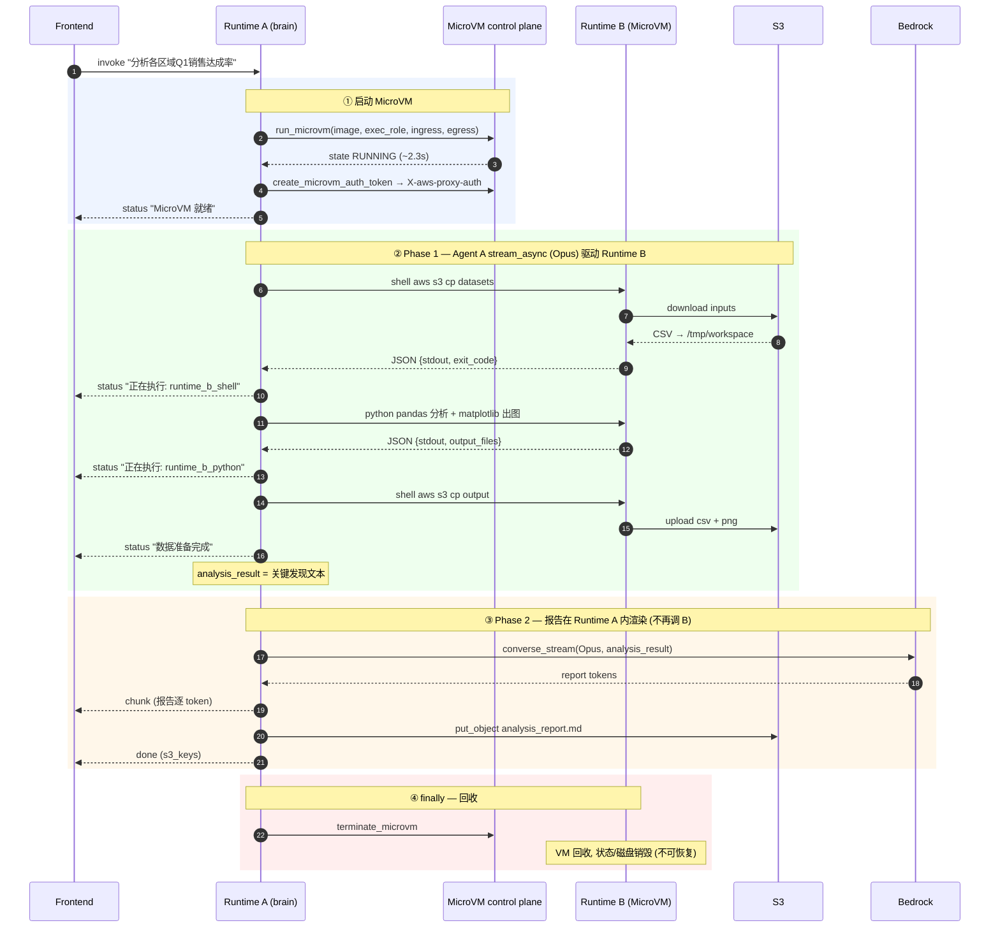
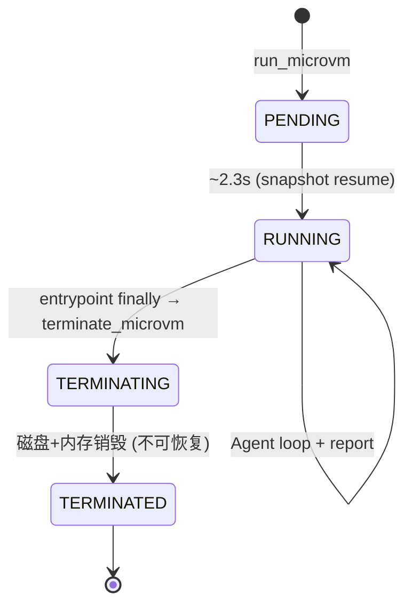

# V5 Complete Workflow Flowchart

V5 = V3 philosophy (Agent A sole brain, Runtime B pure executor), with two changes:
- **Runtime B runs on a Lambda MicroVM** (not AgentCore). Runtime A manages its lifecycle.
- **Report rendering moved into Runtime A** (Runtime B is shell/python only).

## End-to-End Flow



## SSE Event Stream (actual, verified on AWS us-west-2)

```
[status]  正在启动 MicroVM 工作站...              ← ② run_microvm
[status]  MicroVM 就绪 (2.25s)                     ← cold start 2.25s (PENDING→RUNNING)
[status]  Agent 开始分析...                        ← ③
[status]  正在执行: runtime_b_shell                ← ④ Phase 1, 每个 tool call 实时
[status]  正在执行: runtime_b_python
[status]  正在执行: runtime_b_shell
[status]  正在执行: runtime_b_python
[status]  正在执行: runtime_b_shell
[status]  数据准备完成                             ← ⑤
[status]  正在生成分析报告 (Opus streaming)...      ← ⑥ Phase 2, 报告在 A 渲染
[chunk]   # 2026 Q1 各区域销售达成率分析报告 ...    ← 745 chunks 流式
[chunk]   ## 概述 ...
   ...
[done]    s3_keys: [analysis_report.md]            ← put_object 完成
                                                     (MicroVM 在 finally 中 terminate)
= 10 status + 745 chunk + 1 done = 756 events, 184s, exit=0
```

## Lifecycle States (MicroVM, verified)



- Idle policy 配置了 auto-suspend (maxIdleDurationSeconds=900)，但本工作流是单请求秒级完成，
  通常在 idle 触发前就 terminate。suspend/resume 主要服务长 idle 的交互式场景。
- maximumDurationInSeconds=1800（30 min）安全上限；8h 硬上限相关见 [DESIGN_V5.md](DESIGN_V5.md)。

## Key Difference vs V3 (side by side)

```
V3:  Runtime A ──invoke_agent_runtime(session)──▶ Runtime B (AgentCore)
                                                    ├ shell  → JSON
                                                    ├ python → JSON
                                                    └ report → SSE (Opus 在 B)
     同 session 自动路由到同 microVM；平台管生命周期。

V5:  Runtime A ──run_microvm──▶ Runtime B (Lambda MicroVM)
        │                         ├ shell  → JSON
        │ HTTPS + X-aws-proxy-auth ├ python → JSON
        │                         └ (无 report — 已移除)
        └─ report 在 Runtime A 自己渲染 (converse_stream Opus)
        └─ finally terminate_microvm；Runtime A 显式管生命周期。
```
