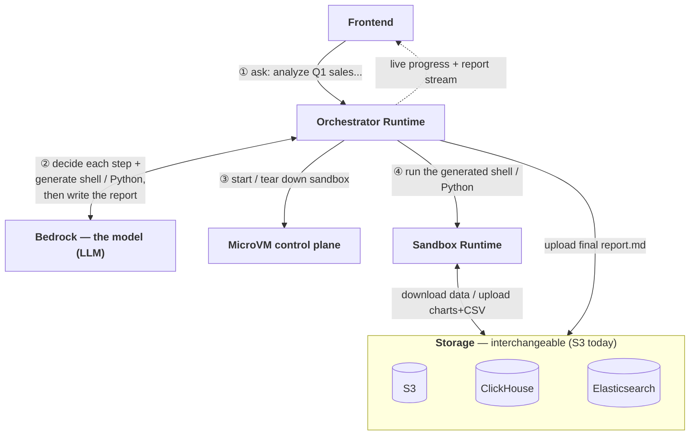

# AgentCore + Lambda MicroVMs Data Analysis with SSE Streaming (V5)

A dual-runtime architecture where **Agent A is the sole brain** (on AWS Bedrock
AgentCore) and **Runtime B is a pure code executor** running on an **AWS Lambda
MicroVM**. Runtime A manages the MicroVM lifecycle per request and renders the
final report itself.

> Changes from V3: Runtime B moved from AgentCore Runtime to a Lambda MicroVM,
> and report rendering moved out of Runtime B into Runtime A. V3 remains on the
> `main` branch. See [DESIGN_V5.md](DESIGN_V5.md) for diagrams and design.

## Architecture



Each module, and what it does / does not do:

| Module | Does | Does NOT |
|--------|------|----------|
| **Frontend** | sends the question; renders live progress + the streaming report | any logic |
| **Orchestrator Runtime** | runs the agent loop; calls the model; starts/stops the sandbox; relays SSE; uploads the report | decide *content* by itself — the model does; touch data files |
| **Bedrock — the model** | **decides each step and generates the shell/Python**, then writes the final report from the findings | execute anything — it only emits decisions + code + text |
| **MicroVM control plane** | starts a fresh isolated sandbox on demand, tears it down when done | run user code |
| **Sandbox Runtime** | executes the model's shell/Python in isolation: fetch data, compute, make charts | make any decision |
| **Storage** | holds per-tenant data in / results out; S3, ClickHouse, ES are interchangeable | — |

What each connection carries, technically:

| Connection | How |
|------------|-----|
| Frontend ↔ Orchestrator | `invoke_agent_runtime`, replies as SSE (`status` / `chunk` / `done`) |
| Orchestrator ↔ Bedrock | `converse_stream`; the model picks a tool and generates its `command`/`code`, then writes the report |
| Orchestrator → control plane | `boto3 lambda-microvms`: run / poll / auth-token / terminate |
| Orchestrator → Sandbox | HTTPS + `X-aws-proxy-auth`; Sandbox exposes `:8080` shell/python, `:9000` lifecycle hooks |
| Sandbox ↔ Storage / Orchestrator → Storage | `aws cli` for data, `put_object` for the report (S3 today) |

> Runtime B's image is **pre-baked** with python + pandas/numpy/matplotlib + aws cli + CJK fonts,
> so the sandbox installs nothing at request time.

**SSE end-to-end, no black box**: while preparing data, every sandbox step is
pushed live; then the report streams back token-by-token as Runtime A writes it.

**Report moved to Runtime A**: Runtime B no longer has an LLM/report action —
it is a pure shell+python executor. Runtime A owns report rendering and upload.

**Image is pre-baked**: pandas/numpy/matplotlib, aws cli, and CJK fonts are
installed into the MicroVM image and captured in its snapshot — the agent never
installs or configures anything at runtime (the system prompt forbids it).

See [DESIGN_V5.md](DESIGN_V5.md) for architecture, the 8-hour limit & roadmap
notes, and the storage comparison vs AgentCore.

## Why a Lambda MicroVM for Runtime B? (vs AgentCore Runtime)

Both run the sandbox on Firecracker, so isolation is the same. The trade is
**explicit control (MicroVM)** vs **zero-ops managed sessions (AgentCore)**.

| | **Lambda MicroVM** (V5 sandbox) | **AgentCore Runtime** (V3 sandbox) |
|---|---|---|
| Isolation | Firecracker microVM | Firecracker microVM (same) |
| Cold start (service-side startup) | **~1.3–1.6s** — `run_microvm` → `RUNNING` provisioning (n=4) | **~4.3s** (light image) to **~9.5s** (heavy image) on a fresh session; **~0.5–0.7s** on a warm-pool microVM; **~0.1–0.2s** warm same-session |
| Invocation / params | HTTPS `POST` to the VM endpoint with `X-aws-proxy-auth`; params in the JSON body (`{"action":"shell","command":...}`) | `bedrock-agentcore invoke_agent_runtime(agentRuntimeArn, runtimeSessionId, payload=<json bytes>)`; params in the payload |
| Reuse same VM vs new VM | no session-id routing — you persist the endpoint from the first `run_microvm` and re-target it. reuse → `ep = run_microvm(...)["endpoint"]` once, then `POST https://{ep}/` on every later request (same VM, same disk); new → call `run_microvm(...)` again for a different endpoint (fresh isolated VM) | reuse → `invoke_agent_runtime(..., runtimeSessionId="sess-abc")` with the **same** id (platform routes to the same compute); new → call with a **different** `runtimeSessionId`. Routed automatically |
| Lifecycle control | **explicit** — you `run` / `suspend` / `terminate`; idle policy (`maxIdleDurationSeconds`, `suspendedDurationSeconds`) is configurable | **managed** — the compute is kept alive while your `/ping` returns `HealthyBusy`, auto-suspended after ~15 min `Healthy` (idle); `StopRuntimeSession` to stop early |
| Max runtime | **8 h hard cap per VM, terminal** — running + suspended combined; suspend does NOT reset it; on expiry the VM is destroyed and you must start a new one | **8 h per compute, but the session survives** — at 8 h the compute is recycled; the next invocation auto-provisions a **fresh compute (another 8 h)**, and the session stays valid until the runtime ARN is deleted |
| Streaming (SSE) | native on the endpoint | native |
| Local disk (the compute's own) | up to **32 GB**; **destroyed when the VM terminates** (incl. at the 8 h cap) — not persistent | size **not published**; **destroyed when the compute is terminated/stopped** — not persistent |
| Mountable filesystems | **no managed mount** — DIY only: **EFS** via a VPC egress connector + NFS 2049 + `additionalOsCapabilities:["ALL"]` (`mount -t nfs4` in the `/run` hook); **S3** via Mountpoint-for-S3 (FUSE, no-append/no-rename limits). V5 skips both and just `aws s3 cp` to S3 | **native `filesystemConfigurations`**, no mount code: managed **session storage** (`/mnt/workspace`, per-session, flush-on-stop / restore-on-resume), or BYO **EFS** / **S3 Files** mounts (shared across sessions/agents, VPC required) |
| Durable result store | **S3** (results land in `tenants/{id}/reports/`) | **S3** too, plus the mounts above |
| Network bandwidth | tied to size (2 GB/1 vCPU ≈ 4 MB/s) | not size-throttled |
| Dependencies | **pre-baked into the image snapshot** | installed in the container image |

> Cold start = **service-side startup only** (provisioning until the VM is
> serving); client↔service network round-trips are excluded (same-region RTT
> ~10 ms is negligible at this scale). AWS publishes no figure for either.
> AgentCore's cold cost is dominated by per-session attach + app import, not
> microVM boot, so it scales with image weight.

> **What actually survives a restart:** the compute's **local disk does not** — it
> is destroyed with the VM on both sides. AgentCore's `/mnt/workspace` looks like
> it "persists across stop/resume" but the mechanism is **flush-to-durable-backend
> on stop → restore onto a brand-new compute on resume**, scoped to that **one
> session** (isolated per session, 14-day idle expiry). It is **not** the same disk
> staying alive, and **not** a channel to another session. For anything that must
> truly outlive a session, both sides write to S3 (or AgentCore mounts EFS / S3 Files).

> **The 8 h cap differs in kind between the two.**
> - **MicroVM:** `maximumDurationInSeconds` counts **running + suspended together**
>   from `run_microvm`; suspend pauses billing, not the clock (run 7 h → resume →
>   ~1 h left). At 8 h the VM is **terminated — terminal**. To go past 8 h *today*
>   you start a new VM and restore from S3 (relay pattern in [DESIGN_V5.md](DESIGN_V5.md));
>   AWS's planned **snapshot-to-S3 + restore** will solve this directly by carrying
>   full VM state (memory + disk) into a fresh-lease VM.
> - **AgentCore:** 8 h is **per compute, not per session**. At 8 h the compute is
>   recycled; the next invocation **auto-provisions a fresh compute (another 8 h)**
>   and — if session storage is configured — restores `/mnt/workspace`. The session
>   stays alive until you delete the runtime. So AgentCore does the compute-relay
>   for you (disk only; memory is not preserved).

**Pick MicroVM when** you want explicit per-request sandboxes and lifecycle
control (and don't mind managing the endpoint + your own >8 h relay). **Pick
AgentCore when** you want zero-ops session routing and automatic compute recycling
across the 8 h boundary. Neither preserves **memory** across that boundary today.

## Prerequisites

- AWS account with Bedrock model access (Claude Opus 4.6)
- A Lambda MicroVMs region: `us-east-1`, `us-east-2`, `us-west-2`, `eu-west-1`, `ap-northeast-1`
- **boto3 ≥ 1.43.36** (for the `lambda-microvms` / `lambda-core` clients)
- AWS credentials configured (`aws configure`)
- Docker (to build the MicroVM image artifact)

## Deploy

### 1. Create S3 bucket and sample data

```bash
export REGION=us-west-2
export DATA_BUCKET=agentcore-zoom-demo-$(aws sts get-caller-identity --query Account --output text)
aws s3 mb s3://$DATA_BUCKET --region $REGION
DATA_BUCKET=$DATA_BUCKET AWS_REGION=$REGION python3 generate_sample_data.py
```

> Note: the artifact bucket used to build the MicroVM image must be in the
> **same region** as the build (a cross-region artifact fails the build).

### 2. Build the Runtime B MicroVM image + IAM roles

```bash
REGION=$REGION DATA_BUCKET=$DATA_BUCKET ./deploy_v5.sh
```

`deploy_v5.sh` creates the build/execution IAM roles, packages `runtime_b_v5/`,
uploads it to S3, and calls `create-microvm-image`. This is where all
dependencies (pandas/numpy/matplotlib, aws cli, CJK fonts) are **baked into the
image** via the Dockerfile and frozen in the snapshot — nothing installs at
request time. To add libraries, edit `runtime_b_v5/requirements.txt` and
rebuild; see **Dependency pre-baking** in [DESIGN_V5.md](DESIGN_V5.md) for the
exact steps. Poll until `CREATED`:

```bash
aws lambda-microvms get-microvm-image --region $REGION \
  --image-identifier arn:aws:lambda:$REGION:<acct>:microvm-image:data_workstation_v5
```

### 3. Deploy Runtime A (agent brain) to AgentCore

```bash
cd runtime_a_v5
agentcore configure --create --name data_router_v5 --entrypoint main.py --region $REGION --non-interactive
# Enable ecr_auto_create and s3_auto_create in .bedrock_agentcore.yaml
agentcore deploy \
  --env DATA_BUCKET=$DATA_BUCKET \
  --env AWS_REGION=$REGION \
  --env MODEL_ID=us.anthropic.claude-opus-4-6-v1 \
  --env OPUS_MODEL_ID=us.anthropic.claude-opus-4-6-v1 \
  --env MICROVM_IMAGE_ARN=<image-arn-from-step-2> \
  --env MICROVM_EXEC_ROLE_ARN=<exec-role-arn-from-step-2>
```

Runtime A's AgentCore execution role needs:
- `lambda-microvms`: `RunMicrovm`, `GetMicrovm`, `CreateMicrovmAuthToken`, `TerminateMicrovm`
- `iam:PassRole` on the MicroVM execution role
- Bedrock: `InvokeModel`, `InvokeModelWithResponseStream`

### 4. Test

```python
import boto3, json
from botocore.config import Config

client = boto3.client('bedrock-agentcore', region_name='us-west-2',
                      config=Config(read_timeout=600))

resp = client.invoke_agent_runtime(
    agentRuntimeArn='<runtime-a-arn>',
    payload=json.dumps({
        'tenant_id': 'acme-corp',
        'message': '分析各区域Q1销售达成率，给出排名和改进建议'
    }).encode(),
    contentType='application/json',
    accept='text/event-stream',
    qualifier='DEFAULT',
)

for line in resp['response'].iter_lines():
    if line:
        line_str = line.decode('utf-8')
        if line_str.startswith('data: '):
            event = json.loads(line_str[6:])
            if event.get('type') == 'status':
                print(f"[{event['stage']}] {event['message']}")
            elif event.get('type') == 'chunk':
                print(event['content'], end='')
            elif event.get('type') == 'done':
                print(f"\n\nFiles: {[f['s3_uri'] for f in event['s3_keys']]}")
```

**Expected output (verified on AWS us-west-2 — 756 events, 184s):**
```
[provision] 正在启动 MicroVM 工作站...            ← run_microvm
[provision] MicroVM 就绪 (2.25s)                  ← cold start PENDING→RUNNING
[analysis]  Agent 开始分析...
[analysis]  正在执行: runtime_b_shell             ← 准备数据, 每个步骤实时推送
[analysis]  正在执行: runtime_b_python
[analysis]  正在执行: runtime_b_shell
[analysis]  数据准备完成
[report]    正在生成分析报告 (Opus streaming)...  ← 写报告, 由 Runtime A 完成
# 2026 Q1 各区域销售达成率分析报告               ← 逐 token
## 概述
本季度全国综合达成率仅为 49.70%，所有区域均未完成既定目标...
...
                                                  ← MicroVM 在 finally 中 terminate
Files: ['s3://.../analysis_report.md', 's3://.../q1_region_achievement.csv', ...]
```

For the full local-then-real test workflow (Docker A+B, real MicroVM build,
cold-start measurement) and pitfalls, see [TESTING_V5.md](TESTING_V5.md).

## Multi-Tenancy

Runtime A (one AgentCore deployment) + one MicroVM image serve N tenants.

| Layer | Mechanism |
|-------|-----------|
| Compute | One MicroVM per request (Firecracker), terminated after — full isolation |
| Data | S3 `tenants/{tenant_id}/` prefix (prompt-enforced; for strong isolation, scope the MicroVM execution role per tenant) |
| Context | Module-level variable (single request per microVM) |

## File Structure

```
.
├── README.md                       # This file (V5)
├── DESIGN_V5.md                    # Architecture + sequence + lifecycle diagrams, 8h-limit & roadmap, storage
├── TESTING_V5.md                   # Bastion bypass test workflow + pitfalls
├── deploy_v5.sh                    # IAM roles + MicroVM image build + deploy steps
├── runtime_a_v5/
│   ├── main.py                     # Runtime A: Agent A (brain) + MicroVM lifecycle + report
│   ├── Dockerfile
│   └── requirements.txt
├── runtime_b_v5/
│   ├── main.py                     # Runtime B: MicroVM executor (shell, python) + hooks + CJK fonts
│   ├── Dockerfile                  # MicroVM base image (al2023-minimal)
│   └── requirements.txt
├── generate_sample_data.py         # Generate sample data for 2 tenants
└── (V3 reference: runtime_a_v3/, runtime_b_v3/, DESIGN_V3.md — on main branch)
```

## Version History

| Version | Branch | Description |
|---------|--------|-------------|
| V1 | `main` | Runtime A (Sonnet, generates code) + Runtime B (no LLM, exec only) |
| V2 | `v3-design` | Design doc only — single Runtime with sub-agents |
| V3 | `main` | Runtime A (Opus, sole brain) + Runtime B (shell + python + Opus report SSE) |
| V4 | `v4-java-research` | Research: Java + LangGraph feasibility |
| **V5** | **`v5-lambda-microvms`** | **Runtime B → Lambda MicroVM (shell/python only); report rendering moved into Runtime A** |
